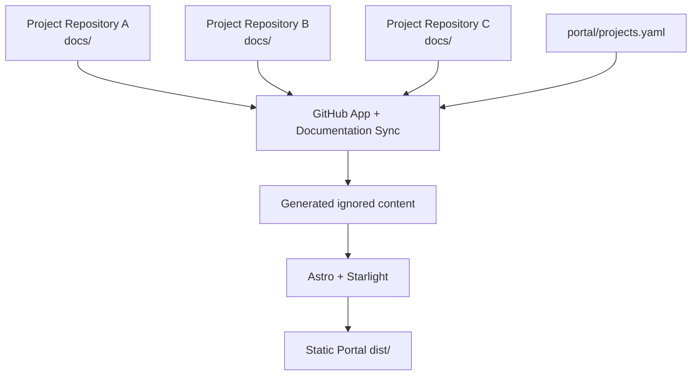

# Developer Documentation Portal

This repository is a lightweight aggregation and presentation layer for internal developer documentation.

The source-of-truth relationship is:

```text
project repository docs/**  ->  portal build  ->  static developer portal
```

Project documentation is never manually maintained here. The registry contains project metadata only, while each project repository owns its <code>docs/**</code> content.

## Architecture



The build resolves each configured branch to a commit, reads the source documentation tree through GitHub’s API, generates a namespaced Starlight content tree, records source metadata, validates internal links, and produces static output.

## Local development

Requirements: Node.js 24 LTS and npm.

For an empty registry, no GitHub token is required. Once projects are registered, provide a short-lived GitHub App installation token with read-only Contents access:

```sh
cp .env.example .env
export GITHUB_TOKEN='...'
npm install
npm run docs:sync
npm run dev
```

The production-equivalent workflow is:

```sh
npm test
npm run typecheck
npm run build
```

<code>npm run build</code> always performs a fresh synchronization and link validation before Astro builds. Generated files under <code>src/content/docs/projects/</code> and <code>src/generated/</code> are ignored and must not be edited or committed.

## Registering a project

1. Create <code>docs/index.md</code> in the source project repository.
2. Add the remaining documentation beneath the same <code>docs/</code> directory.
3. Add one metadata entry to <code>portal/projects.yaml</code>:

   ```yaml
   version: 1

   projects:
     - id: payments-api
       name: Payments API
       description: API and operational documentation
       category: product
       repository: company/payments-api
       branch: main
       docsPath: docs
   ```

4. Open a pull request in this portal repository.
5. Verify validation, synchronization, link checks, and the portal build.
6. Merge after review.

New category values require only a registry entry; they are not hardcoded in the portal.

## GitHub App setup

Create a GitHub App installed on the repositories that may appear in the registry. The synchronization App should have the minimum required permission:

- Repository permissions: <code>Contents: Read-only</code>

Install the App on the portal repository and all registered source repositories. The portal workflow expects:

- Repository variable <code>GITHUB_APP_CLIENT_ID</code>.
- Repository secret <code>GITHUB_APP_PRIVATE_KEY</code> containing the App private key.

The workflow uses <code>actions/create-github-app-token</code> to create a short-lived installation token. The token is passed to synchronization through <code>GITHUB_TOKEN</code>, is scoped to the build job, and is never sent to the browser or written to generated output.

For local work, obtain an appropriate installation token through your organization’s approved GitHub App process and export it as <code>GITHUB_TOKEN</code>. Do not use a personal access token as the production setup.

If using GitHub Enterprise Server, set <code>GITHUB_API_URL</code> to the API base URL.

## Automatic rebuilds from source repositories

Copy <code>examples/project-docs-updated.yml</code> into a source project repository. Configure:

- <code>PORTAL_DISPATCH_APP_CLIENT_ID</code> repository variable.
- <code>PORTAL_DISPATCH_APP_PRIVATE_KEY</code> repository secret.
- <code>PORTAL_OWNER</code> repository variable.
- <code>PORTAL_REPOSITORY_NAME</code> repository variable.

The dispatch-only App should be installed on the portal repository and have only the narrowly scoped permission needed to dispatch the event. The example triggers only when a push to <code>main</code> changes <code>docs/**</code>, then sends the <code>documentation-updated</code> event.

Documentation changes must be made in the source project repository. Never edit generated portal copies.

## Source metadata and links

Every generated document receives:

- source repository;
- source branch;
- source commit SHA;
- UTC ISO-8601 synchronization timestamp;
- direct <code>Edit on GitHub</code> URL for the original source file.

The source metadata is also available in <code>src/generated/project-metadata.json</code> during a build. This file is generated and ignored.

## Testing

Custom synchronization, registry, metadata, and link-validation logic is covered by Vitest with mocked providers and temporary fixtures. Tests do not require access to real private repositories.

The portal is intentionally static-output-only and does not implement portal-user authentication. Place the generated <code>dist/</code> output behind the organization’s chosen access layer or hosting platform.
