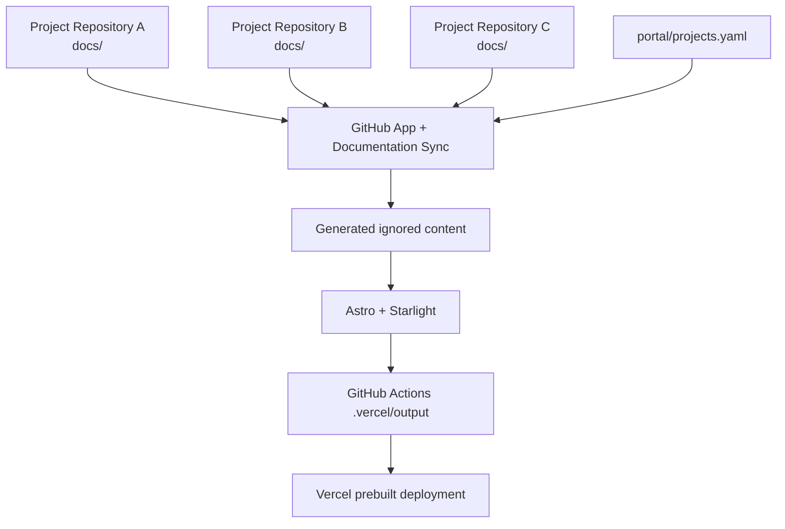

# Developer Documentation Portal

This repository is a lightweight aggregation and presentation layer for internal developer documentation.

The source-of-truth relationship is:

```text
project repository docs/**  ->  portal build  ->  static developer portal
```

Project documentation is never manually maintained here. The registry contains project metadata only, while each project repository owns its <code>docs/**</code> content.

## Architecture



The build resolves each configured branch to a commit, reads the source documentation tree through GitHub’s API, generates a namespaced Starlight content tree, records source metadata, validates internal links, and produces static output. Production hosting uses a prebuilt Vercel deployment: GitHub Actions runs the build and uploads only `.vercel/output` to Vercel.

## Production deployment

The production flow is:

```text
source repositories docs/**
        -> portal workflow dispatch
        -> short-lived Docs Sync App token
        -> tests and registry validation
        -> vercel build --prod in GitHub Actions
        -> .vercel/output
        -> vercel deploy --prebuilt --prod
        -> Vercel hosting
```

The Vercel project is not connected to GitHub and does not run an independent build. The Vercel Build Command remains `npm run build` so the existing synchronization and link-validation lifecycle is preserved when the local Vercel build runs. No server rendering or separate documentation copy is used.

Required Developer Portal repository configuration:

- Variables: `DOCS_APP_CLIENT_ID`, `VERCEL_ORG_ID`, `VERCEL_PROJECT_ID`.
- Secrets: `DOCS_APP_PRIVATE_KEY`, `VERCEL_TOKEN`.

`VERCEL_TOKEN` is used only by GitHub Actions. Never commit or print it. The Docs Sync App private key and the short-lived `GITHUB_TOKEN` remain in GitHub Actions; neither is stored in Vercel or emitted into `.vercel/output`.

Deployment Protection uses Vercel Authentication with Standard Protection. This protects deployment and preview URLs, but the current Vercel plan does not guarantee that the production domain is private. Treat the production URL as a documented security gap until Advanced Deployment Protection or an external access layer is enabled. Do not configure a custom domain before this is resolved.

## Local development

Requirements: Node.js 24 LTS and npm.

For an empty registry, no GitHub token is required. Once projects are registered, provide a short-lived GitHub App installation token with read-only Contents access:

```sh
cp .env.example .env
export GITHUB_TOKEN='...'
npm install
npm run docs:sync
npm run dev
```

The production-equivalent workflow is:

```sh
npm test
npm run typecheck
npm run build
```

<code>npm run build</code> always performs a fresh synchronization and link validation before Astro builds. Generated files under <code>src/content/docs/projects/</code> and <code>src/generated/</code> are ignored and must not be edited or committed.

## Registering a project

1. Create <code>docs/index.md</code> in the source project repository.
2. Add the remaining documentation beneath the same <code>docs/</code> directory.
3. Add one metadata entry to <code>portal/projects.yaml</code>:

   ```yaml
   version: 1

   projects:
     - id: payments-api
       name: Payments API
       description: API and operational documentation
       category: product
       repository: company/payments-api
       branch: main
       docsPath: docs
   ```

4. Open a pull request in this portal repository.
5. Verify validation, synchronization, link checks, and the portal build.
6. Merge after review.

New category values require only a registry entry; they are not hardcoded in the portal.

## GitHub App setup

The portal uses two GitHub Apps with separate responsibilities:

- Documentation Sync App (existing): <code>Contents: Read-only</code>, installed on the portal repository and every registered source repository. The portal workflow expects repository variable <code>DOCS_APP_CLIENT_ID</code> and repository secret <code>DOCS_APP_PRIVATE_KEY</code>.
- Developer Portal Dispatch (dedicated): <code>Actions: Read and write</code> plus GitHub-mandatory <code>Metadata: Read-only</code>, installed only on the <code>developer-portal</code> repository. It has no Contents write access and is not installed on source repositories.

The portal workflow uses <code>actions/create-github-app-token@v3</code> to create a short-lived synchronization token from the existing Sync App. The token is passed through <code>GITHUB_TOKEN</code> to synchronization and is never sent to the browser or written to generated output.

The source trigger workflow uses the Dispatch App credentials:

- repository variable <code>DOCS_DISPATCH_APP_CLIENT_ID</code>;
- repository secret <code>DOCS_DISPATCH_APP_PRIVATE_KEY</code> containing the App private key.

Never commit or print private keys, installation tokens, or secret values. Do not use a personal access token for this integration.

## Automatic rebuilds from source repositories

Source repositories should trigger the portal only; synchronization, validation, building, and artifact publishing remain in <code>developer-portal</code>.

Create <code>.github/workflows/developer-portal-docs.yml</code> in a registered source repository:

```yaml
name: Rebuild Developer Portal Documentation

on:
  push:
    branches:
      - main
    paths:
      - "docs/**"

permissions:
  contents: read

jobs:
  dispatch:
    runs-on: ubuntu-latest
    steps:
      - name: Create Developer Portal dispatch token
        id: dispatch-token
        uses: actions/create-github-app-token@v3
        with:
          client-id: ${{ vars.DOCS_DISPATCH_APP_CLIENT_ID }}
          private-key: ${{ secrets.DOCS_DISPATCH_APP_PRIVATE_KEY }}
          owner: ${{ github.repository_owner }}
          repositories: developer-portal

      - name: Trigger Developer Portal workflow
        env:
          GH_TOKEN: ${{ steps.dispatch-token.outputs.token }}
        run: gh workflow run portal.yml --repo "${{ github.repository_owner }}/developer-portal" --ref main
```

The portal workflow filename is <code>.github/workflows/portal.yml</code> and it supports <code>workflow_dispatch</code>. It validates the registry, synchronizes documentation, validates links, builds Astro/Starlight output, and publishes the static artifact.

To adopt this mechanism in another registered source repository:

1. Install the existing Documentation Sync App on the source repository with <code>Contents: Read-only</code>.
2. Install the Dispatch App only on <code>developer-portal</code>; do not install it on the source repository.
3. Create the two Dispatch App credentials above in the source repository.
4. Copy the trigger workflow and keep its repository target restricted to <code>developer-portal</code>.
5. Open a PR and verify a documentation push to <code>main</code> starts <code>portal.yml</code>.

Local work may use an approved short-lived Sync App installation token through <code>GITHUB_TOKEN</code>. If using GitHub Enterprise Server, set <code>GITHUB_API_URL</code> to the API base URL.
## Source metadata and links

Every generated document receives:

- source repository;
- source branch;
- source commit SHA;
- UTC ISO-8601 synchronization timestamp;
- direct <code>Edit on GitHub</code> URL for the original source file.

The source metadata is also available in <code>src/generated/project-metadata.json</code> during a build. This file is generated and ignored.

## Testing

Custom synchronization, registry, metadata, and link-validation logic is covered by Vitest with mocked providers and temporary fixtures. Tests do not require access to real private repositories.

The portal is intentionally static-output-only and does not implement portal-user authentication. Its production access control is provided by Vercel Deployment Protection, with the Standard Protection limitation documented above.
